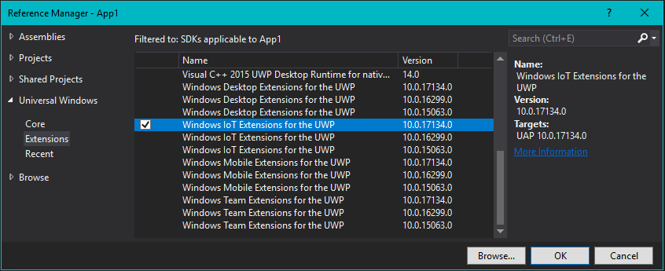
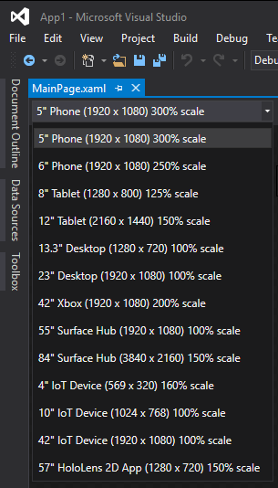

# Device families overview

In order to understand how Windows 10 allows you to target different classes of devices, it's helpful to understand a concept called device families. A device family identifies the APIs, system characteristics, and behaviors that you can expect across a class of devices. It also determines the set of devices on which your app can be installed from the Store. A device family (with the exception of the Universal device family) is implemented as an extension SDK, which is covered in further detail in the [Extension SDKs](#extension-sdks) section. This diagram demonstrates the device family hierarchy.


A device family defines a set of APIs, is versioned, and is the foundation of an OS. PCs and tablets run the desktop OS, which is based on the desktop device family. Phones run the mobile OS, which is based on the mobile device family.

Each child device family adds its own APIs to the ones it inherits. The resulting union of APIs in a child device family is guaranteed to be present in the OS based on that device family, and on every device running that OS.

One benefit of the universal device family is that your app can run on a variety of devices; phones, tablets, desktop computers, Surface Hubs, Xbox consoles, and HoloLens, to name a few. Your app can also use adaptive code to dynamically detect and use features of a device that are outside of the universal device family.

The decision about which device family (or families) your app will target is yours to make. And that decision impacts your app in these important ways. It determines:

- The set of APIs that your app can assume to be present when it runs (and can therefore call freely).
- The set of API calls that are safe only inside conditional statements.
- The set of devices on which your app can be installed from the Store (and consequently the form factors that you need to consider when you design the UI).

There are two main consequences of making a device family choice: the API surface that can be called unconditionally by the app, and the number of devices the app can reach. These two factors involve tradeoffs and are inversely related. For example, a UWP app is an app that specifically targets the universal device family, and consequently is available to all devices. An app that targets the universal device family can assume the presence of only the APIs in the universal device family. Other APIs must be called conditionally. Also, such an app must have a highly adaptive UI and comprehensive input capabilities because it can run on a wide variety of devices. A Windows mobile app is an app that specifically targets the mobile device family, and is available to devices whose OS is based on the mobile device family (which includes phones, tablets, and similar devices). A mobile device family app can assume the presence of all APIs in the mobile device family, and its UI has to be moderately adaptive. An app that targets the IoT device family can be installed only on IoT devices and can assume the presence of all APIs in the IoT device family. That app can be very specialized in its UI and input capabilities because you know that it will run only on a specific type of device.

<iframe src="https://channel9.msdn.com/Blogs/One-Dev-Minute/Introduction-to-UWP-and-Device-Families/player" width="640" height="360" allowFullScreen frameBorder="0"></iframe>

Here are some considerations to help you decide which device family to target:

**Maximizing your app's reach**

To reach the maximum range of devices with your app, and to have it run on as many devices as possible, your app will target the universal device family. By doing so, the app automatically targets every device family that's based on universal (in the diagram, all the children of universal). That means that the app runs on every OS based on those device families, and on all the devices that run those operating systems. The only APIs that are guaranteed to be available on all those devices is the set defined by the particular version of the universal device family that you target. To find out how an app can call APIs outside of its target device family version, see [Writing Code](#writing-code) later in this topic.

**Limiting your app to one kind of device**

You may not want your app to run on a wide range of devices; perhaps it's specialized for a desktop PC or for an Xbox console. In that case you can choose to target your app at one of the child device families. For example, if you target the desktop device family, the APIs guaranteed to be available to your app, include the APIs inherited from the universal device family, as well as the APIs that are particular to the desktop device family.

**Limiting your app to a subset of all possible devices**

Instead of targeting the universal device family, or targeting one of the child device families, you can instead target two (or more) child device families. Targeting desktop and mobile might make sense for your app. Or desktop and HoloLens. Or desktop, Xbox and Surface Hub, and so on.

**Excluding support for a particular version of a device family**

In rare cases, you may want your app to run everywhere except on devices with a particular version of a particular device family. For example, let's say your app targets version 10.0.x.0 of the universal device family. When the operating system version changes in the future, say to 10.0.x.2, at that point you can specify that your app runs everywhere except version 10.0.x.1 of Xbox by targeting your app to 10.0.x.0 of universal and 10.0.x.2 of Xbox. Your app will then be unavailable to the set of device family versions within Xbox 10.0.x.1 (inclusive) and earlier.

By default, Microsoft Visual Studio specifies **Windows.Universal** as the target device family in the app package manifest file. To specify the device family or device families that your app is offered to from within the Store, manually configure the [**TargetDeviceFamily**](https://msdn.microsoft.com/library/windows/apps/dn986903) element in your Package.appxmanifest file.

## Extension SDKs

The Windows SDK includes extension SDKs that let you call specialized APIs for different devices. Once you have decided on the device family that your app will target, add a reference to the Extension SDK(s) that implement the APIs for that device family.  If you are targeting the Universal device family, you don't need to reference an extension SDK. But if you are targeting a device family besides Universal, in Visual Studio you will add a reference to the extension SDK that matches the device family you have chosen.

For example, if you are targeting the IoT device family, you would add a reference (Project > Add Reference) to the _Windows IoT Extensions for the UWP_ in Visual Studio's Reference Manager:



Selecting a device family does not prohibit you from adding extension SDKs for other types of devices. You will just need to ensure that you test for the presence of APIs not included in the device family you have chosen as described below in [Writing Code](#writing-code).

## Tooling

By default, you'll probably want to target the broadest possible device family. When you're ready to see how your app looks and lays out on a particular device, use the device preview toolbar in Visual Studio to preview your UI on a small or medium mobile device, on a PC, or on a large TV screen. That way you can tailor and test your adaptive visual states:



You don't have to make a decision up front about every device type that you'll support. You can add an additional device size to your project later.

## Writing code

Much of your code will be universal and it will run the same way everywhere. But for code tailored to particular device families, you'll have the option to use adaptive code. Let's consider these different cases:

**Calling an API that's implemented by your target device family**

Whenever you want to call an API in a UWP app, you'll want to know whether the API is implemented by the device family that your app is targeting. Visual Studio Intellisense only shows you the APIs that are available for the extension SDKs that you have chosen. If you have not selected an extension SDK, you'll see only the APIs available to the Universal device family.

The API documentation also tells you which device family an API is part of. If you look at the Requirements section, you'll see what the implementing device family is and which version of that device family the API appears in.

**Calling an API that's NOT implemented by your target device family**

There will be cases when you want to call an API in an extension SDK that you've referenced, but that API is not part of the device family you are targeting. For example, you may be targeting the universal device family, but have a desktop API that you'd like to use if the app happens to be running on a desktop device. In that case, you can opt to write adaptive code in order to call that API.

**Writing adaptive code with the ApiInformation class**

There are two steps to write adaptive code. The first step is to make the APIs that you want to access available to your project. To do that, add a reference to the extension SDK that represents the device family that owns the APIs that you want to conditionally call. For more information, see the **Extension SDKs** section in [Porting Windows Phone Silverlight projects to UWP projects](https://docs.microsoft.com/windows/uwp/porting/wpsl-to-uwp-porting-to-a-uwp-project).

The second step is to use the [**Windows.Foundation.Metadata.ApiInformation**](https://msdn.microsoft.com/library/windows/apps/dn949001) class in a condition in your code to test for the presence of the API you want to call. This condition is evaluated wherever your app runs, but it evaluates to true only on devices where the API is present and therefore available to call.

If you want to call just a small number of APIs, you could use the [**ApiInformation.IsTypePresent**](https://msdn.microsoft.com/library/windows/apps/dn949016) method like this.

```csharp
    // Note: Cache the value instead of querying it more than once.
    bool isHardwareButtonsAPIPresent =
        Windows.Foundation.Metadata.ApiInformation.IsTypePresent("Windows.Phone.UI.Input.HardwareButtons");

    if (isHardwareButtonsAPIPresent)
    {
        Windows.Phone.UI.Input.HardwareButtons.CameraPressed +=
            HardwareButtons_CameraPressed;
    }
```

In this case, there is confidence that the presence of the [**HardwareButtons**](https://msdn.microsoft.com/library/windows/apps/jj207557) class implies the presence of the [**CameraPressed**](https://msdn.microsoft.com/library/windows/apps/dn653805) event, because the class and the member have the same requirements info. But in time, new members will be added to already-introduced classes, and those members will have later "introduced in" version numbers. In such cases, instead of using **IsTypePresent**, you can test for the presence of individual members by using **IsEventPresent**, **IsMethodPresent**, **IsPropertyPresent**, and similar methods. Here's an example.

```csharp
    bool isHardwareButtons_CameraPressedAPIPresent =
        Windows.Foundation.Metadata.ApiInformation.IsEventPresent
            ("Windows.Phone.UI.Input.HardwareButtons", "CameraPressed");
```

The set of APIs within a device family is further broken down into subdivisions known as API contracts. You can use the **ApiInformation.IsApiContractPresent** method to test for the presence of an API contract. This is useful if you want to test for the presence of a large number of APIs that all exist in the same version of an API contract.

```csharp
    bool isWindows_Devices_Scanners_ScannerDeviceContract_1_0Present =
        Windows.Foundation.Metadata.ApiInformation.IsApiContractPresent
            ("Windows.Devices.Scanners.ScannerDeviceContract", 1, 0);
```

## See also

[Version adaptive code](https://docs.microsoft.com/windows/uwp/debug-test-perf/version-adaptive-code)