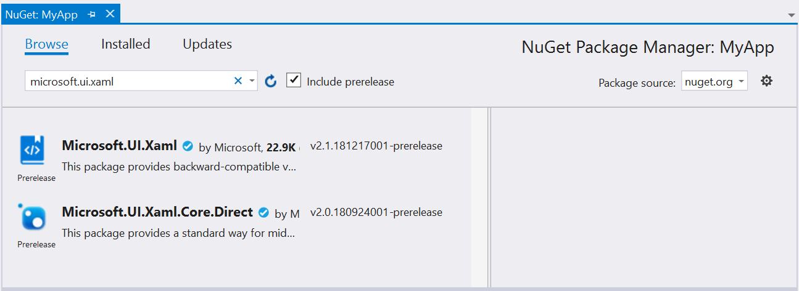

# Getting started with the Windows UI Library

The toolkit is available as NuGet packages that can be added to any existing or new project using Visual Studio.

## Download and install the Windows UI Library

1. Download [Visual Studio 2017](https://developer.microsoft.com/windows/downloads) and ensure you choose the **Universal Windows Platform development** Workload in the Visual Studio installer.

    > [!NOTE]
    Visual Studio 2015 doesn't support the Windows UI Library. 

2. Open an existing project, or create a new project using the Blank App template under Visual C# -> Windows -> Universal, or the appropriate template for your language projection.  
    > **Important**:  To use the Windows UI Library, your project’s Min version must be 14393 or higher and the Target version must be 17134 or higher.   

3. In the Solution Explorer panel, right click on your project name and select **Manage NuGet Packages**. Select the **Browse** tab, and search for **Microsoft.UI.Xaml**. Then choose which [Windows UI Library NuGet Packages](nuget-packages.md) you want to use.   
The **Microsoft.UI.Xaml** package contains Fluent controls and features suitable for all apps.  
You can optionally check "Include prerelease" to see the latest prerelease versions that include experimental new features.

    

    

4. Add the Windows UI (WinUI) Theme Resources to your App.xaml resources. There are two ways to do this, depending on whether you have additional application resources. 

    a. If you don't have other application resources, 
    add `<XamlControlsResources xmlns="using:Microsoft.UI.Xaml.Controls"/>` to your Application.Resources: 

    ``` XAML
    <Application>
        <Application.Resources>
            <XamlControlsResources xmlns="using:Microsoft.UI.Xaml.Controls"/> 
        </Application.Resources>
    </Application>
    ```

    b. Otherwise, if you have more than one set of application resources, add `<XamlControlsResources xmlns="using:Microsoft.UI.Xaml.Controls"/>` to  Application.Resources.MergedDictionaries:

    ``` XAML
    <Application>
        <Application.Resources>
            <ResourceDictionary>
                <ResourceDictionary.MergedDictionaries>
                    <XamlControlsResources  xmlns="using:Microsoft.UI.Xaml.Controls"/>
                </ResourceDictionary.MergedDictionaries> 
            </ResourceDictionary>
        </Application.Resources>
    </Application>
    ```

5. Add a reference to the toolkit to XAML pages and your code-behind pages.

    * In your XAML page, add a reference at the top of your page

        ```xaml
        xmlns:controls="using:Microsoft.UI.Xaml.Controls"
        ```

    * In your code (if you want to use the type names without qualifying them), you can add a using directive.

        ```csharp
        using MUXC = Microsoft.UI.Xaml.Controls;
        ```

## Additional steps for a C++/WinRT project

When you add a NuGet package to a C++/WinRT project, the tooling generates a set of projection headers in your project's `\Generated Files\winrt` folder. To bring those headers files into your project, so that references to those new types resolve, you can go into your `pch.h` file and include them. Below is an example that includes the generated header files for the **Microsoft.UI.Xaml** package.

```cppwinrt
// pch.h
...
#include "winrt/Microsoft.UI.Xaml.Automation.Peers.h"
#include "winrt/Microsoft.UI.Xaml.Controls.Primitives.h"
#include "winrt/Microsoft.UI.Xaml.Media.h"
#include "winrt/Microsoft.UI.Xaml.XamlTypeInfo.h"
```

## Contributing to the Windows UI Library

WinUI is an open source project hosted on GitHub.

We welcome bug reports, feature requests and community code contributions in the [Windows UI Library repo](https://aka.ms/winui).

## Other Resources 

If you're new to UWP, then we recommend that you visit the [Getting Started with UWP Development](https://developer.microsoft.com/windows/getstarted) pages on the Developer portal.
