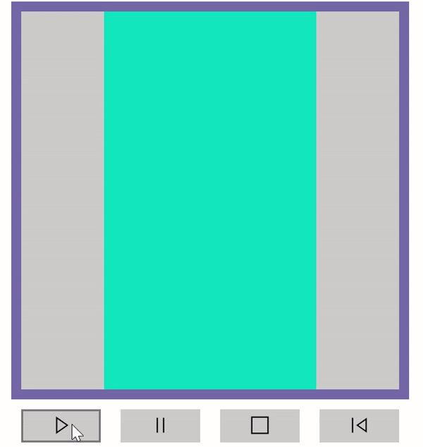
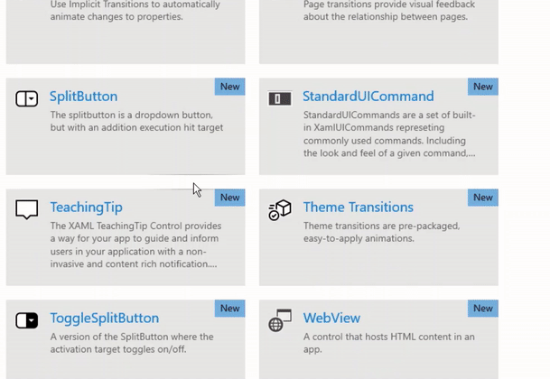
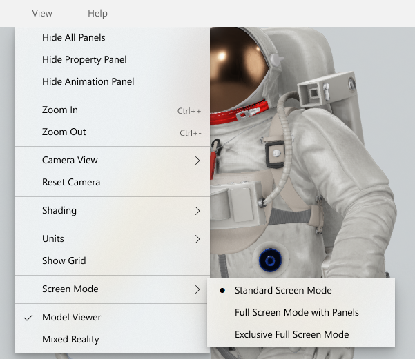
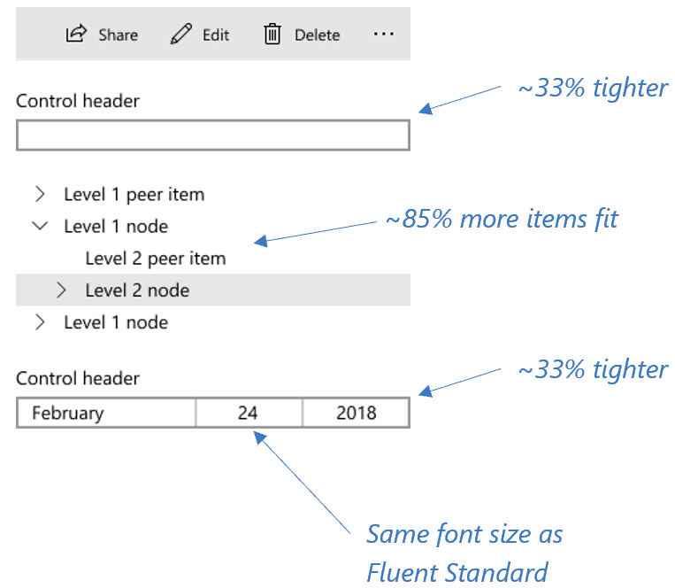

# Windows UI Library 2.1

The latest official version of the Windows UI Library – WinUI 2.1 – was just released April 8, 2019 

WinUI gives you many of the latest Windows UX platform features, including up-to-date Fluent controls and styles, available in a way you can use right away, backward-compatible to Windows 10 Anniversary Update (14393). The [XAML Controls Gallery](https://docs.microsoft.com/en-us/windows/uwp/design/controls-and-patterns/#xaml-controls-gallery) gives you samples to explore all the cool new features added to the library.

Download the [WinUI 2.1 NuGet package](https://www.nuget.org/packages/Microsoft.UI.Xaml/2.1.190405004)

You can choose to use the WinUI packages in your app using the NuGet package manager: see [Getting Started with the Windows UI Library](https://docs.microsoft.com/en-us/uwp/toolkits/winui/getting-started) for more information.

WinUI is an open source project hosted on GitHub. We welcome bug reports, feature requests and community code contributions in the [Windows UI Library repo](https://aka.ms/winui).

## COOL NEW FEATURES!

[ItemsRepeater](https://docs.microsoft.com/windows/uwp/design/controls-and-patterns/items-repeater)

Use an ItemsRepeater to create custom collection experiences using a flexible layout system, custom views, and virtualization.
Unlike ListView, ItemsRepeater does not provide a comprehensive end-user experience – it has no default UI and provides no policy around focus, selection, or user interaction. Instead, it’s a building block that you can use to create your own unique collection-based experiences and custom controls. It supports building of richer and more performant experiences.

[AnimatedVisualPlayer](https://docs.microsoft.com/windows/communitytoolkit/animations/lottie)

The AnimatedVisualPlayer hosts and controls playback of animated visuals, enabling you to add high performance custom motion graphics to your app. For instance, the AnimatedVisualPlayer is used to display and control Lottie animations.

[TeachingTip](https://docs.microsoft.com/windows/uwp/design/controls-and-patterns/dialogs-and-flyouts/teaching-tip)

TeachingTip provides an engaging and Fluent way for applications to guide and inform users with non-invasive and content-rich tips. TeachingTip can bring focus to new or important features, teach users how to perform tasks, and enhance workflow by providing contextually relevant information to your task at hand.

[Shadows applied to new set of controls ](https://review.docs.microsoft.com/en-us/windows/uwp/design/layout/depth-shadow?branch=release-19h1)

Shadow is one way a user perceives elevation. Light above an elevated object creates a shadow on the surface below. The higher the object, the larger and softer the shadow becomes. Elevated objects in your UI don’t need to have shadows, but they help create the appearance of elevation.  

In the physical world, we tend to focus on objects that are closer to us. We can apply this spatial instinct to digital UI as well. For example, if you bring an element closer to the user, then the user will instinctively focus on the element. By moving UI elements closer in z-axis, you can establish visual hierarchy between objects, helping users complete tasks naturally and efficiently in your app.

The NavigationView and TeachingTip controls in WinUI now have default shadows in WinUI 2.1. The full list of controls that have default shadows in the Windows 10 May 2019 Update is available [here](https://docs.microsoft.com/windows/uwp/design/layout/depth-shadow).

[RadioMenuFlyoutItem](https://review.docs.microsoft.com/en-us/windows/uwp/design/controls-and-patterns/menus?branch=release-winui#create-a-menu-flyout-or-a-context-menu)

It is the ability to have 'Radio Button' style options in a MenuBar. This allows for groups of options with bullets which are tied together like a radio button group. The logic is handled for the developer.

[CompactDensity](https://docs.microsoft.com/en-us/windows/uwp/design/style/spacing)

Compact mode enable developers to create comfortable experiences for any number of scenarios. Simply by adding a resource dictionary your application can fit on average ~33% more UI.

## Microsoft.UI.Xaml 2.1 Version History

### Microsoft.UI.Xaml 2.1 Official release

April 2019

[GitHub release page](https://github.com/Microsoft/microsoft-ui-xaml/releases)

[NuGet package download](https://www.nuget.org/packages/Microsoft.UI.Xaml/2.1.190405004)

#### New features (not included in earlier pre-releases)

* [Shadows applied to new set of controls ](https://review.docs.microsoft.com/en-us/windows/uwp/design/layout/depth-shadow?branch=release-19h1):
Shadow is one way a user perceives elevation. Light above an elevated object creates a shadow on the surface below. The higher the object, the larger and softer the shadow becomes. Elevated objects in your UI don’t need to have shadows, but they help create the appearance of elevation. 

* [CompactDensity](https://docs.microsoft.com/en-us/windows/uwp/design/style/spacing) :
Compact mode enable developers to create comfortable experiences for any number of scenarios. Simply by adding a resource dictionary your application can fit on average ~33% more UI.

### Microsoft.UI.Xaml 2.1.190218001-prerelease

February 2019

[GitHub release page](https://github.com/Microsoft/microsoft-ui-xaml/releases/tag/v2.1.190219001-prerelease)

[NuGet package download](https://www.nuget.org/packages/Microsoft.UI.Xaml/2.1.190218001-prerelease)

#### New Experimental features

* [TeachingTip control](https://github.com/Microsoft/microsoft-ui-xaml/issues/21)  
  This new control provides a way for your app to guide and inform users in your application with a non-invasive and content rich notification. TeachingTip can be used for bringing focus to a new or important feature, teaching users how to perform a task, or enhancing the user workflow by providing contextually relevant information to their task at hand.

### Microsoft.UI.Xaml 2.1.190131001-prerelease

February 2019

[GitHub release page](https://github.com/Microsoft/microsoft-ui-xaml/releases/tag/v2.1.190131001-prerelease)

[NuGet package download](https://www.nuget.org/packages/Microsoft.UI.Xaml/2.1.190131001-prerelease)

#### New Experimental features

* [AnimatedVisualPlayer](https://docs.microsoft.com/uwp/api/microsoft.ui.xaml.controls.animatedvisualplayer)  
  This new control enables playing complex high performance vector animations, including [Lottie](https://github.com/airbnb/lottie) animations created using [Lottie-Windows](https://docs.microsoft.com/windows/communitytoolkit/animations/lottie).

### Microsoft.UI.Xaml 2.1.181217001-prerelease

December 2018

[GitHub release page](https://github.com/Microsoft/microsoft-ui-xaml/releases/tag/v2.1.181217001-prerelease)

[NuGet package download](https://www.nuget.org/packages/Microsoft.UI.Xaml/2.1.181217001-prerelease)

#### New Experimental features

* [ItemsRepeater](https://docs.microsoft.com/uwp/api/microsoft.ui.xaml.controls.itemsrepeater)

* [RadioButtons](https://docs.microsoft.com/uwp/api/microsoft.ui.xaml.controls.radiobuttons)

* [RadioMenuFlyoutItem](https://docs.microsoft.com/uwp/api/microsoft.ui.xaml.controls.radiomenuflyoutitem)

