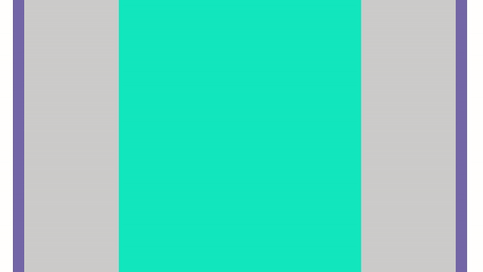
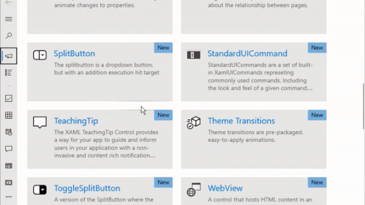
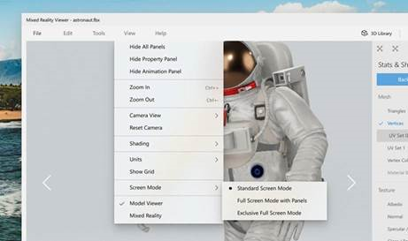
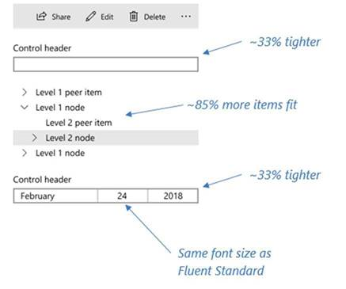

# Windows UI Library 2.1

WinUI 2.1 is the second major release of the Windows UI Library. 

WinUI is the easiest way to build great Fluent Design experiences for Windows, and is backward-compatible to Windows 10 Anniversary Update (14393). Samples are readily available for you try out each feature. Sample links are included in the documentation for each feature.

The library includes two NuGet packages:

* [Microsoft.UI.Xaml](https://www.nuget.org/packages/Microsoft.UI.Xaml): Controls and Fluent Design for UWP apps. This is the main WinUI package.

* [Microsoft.UI.Xaml.Core.Direct](https://www.nuget.org/packages/Microsoft.UI.Xaml.Core.Direct): Low-level APIs for use in middleware components.

You can download and use WinUI packages in your app using the NuGet package manager: see [Getting Started with the Windows UI Library](https://docs.microsoft.com/en-us/uwp/toolkits/winui/getting-started) for more information.

WinUI is an open source project hosted on GitHub. We welcome bug reports, feature requests and community code contributions in the [Windows UI Library repo](https://aka.ms/winui).

## Microsoft.UI.Xaml 2.1 Version History

### Microsoft.UI.Xaml 2.1 Public release

April 2019

[GitHub release page](Insert Link)

[NuGet package download](Insert Link)

Here is the list of new features included in the public release of WinUI2.1!

[ItemsRepeater](https://docs.microsoft.com/en-us/windows/uwp/design/controls-and-patterns/items-repeater)

Use an ItemsRepeater to create custom collection experiences using a flexible layout system, custom views, and virtualization.
Unlike ListView, ItemsRepeater does not provide a comprehensive end-user experience – it has no default UI and provides no policy around focus, selection, or user interaction. Instead, it’s a building block that you can use to create your own unique collection-based experiences and custom controls. It supports building of richer and more performant experiences.

[AnimatedVisualPlayer](https://docs.microsoft.com/en-us/windows/communitytoolkit/animations/lottie)

The AnimatedVisualPlayer hosts and controls playback of an animated Visual tree, integrating custom motion graphic content with XAML UI. For instance, the AnimatedVisualPlayer is used to display and control Lottie animations.

[TeachingTip](https://review.docs.microsoft.com/windows/uwp/design/controls-and-patterns/dialogs-and-flyouts/teaching-tip?branch=release-winui)

TeachingTip provides an engaging and Fluent way for applications to guide and inform users with non-invasive and content rich tips. TeachingTip can bring focus to new or important features, teach users how to perform tasks, and enhance workflow by providing contextually relevant information to your task at hand.

[Shadows applied to new set of controls ](https://review.docs.microsoft.com/en-us/windows/uwp/design/layout/depth-shadow?branch=release-19h1)

Shadow is a way for human to perceive elevation. When there is light above an elevated object, there is a shadow on the surface below. We are using this natural human perception to add focus to popup type UIs that require user's immediate and quick attention. We are calling attention to these UI by bringing them forward in z-depth (by way of adding shadows) for user to easily and seamlessly take a quick action. NavigationView and TeachingTip are the two controls to which default shadows have now been added in the this public release of WinUI2.1. To refer to the complete list of controls that get shadows by default with 19H1 SDK release, please look at the document here (add link)

[RadioMenuFlyout](https://review.docs.microsoft.com/en-us/windows/uwp/design/controls-and-patterns/menus?branch=release-winui#create-a-menu-flyout-or-a-context-menu)

It is the ability to have 'Radio Button' style options in a MenuBar. This allows for groups of options with bullets which are tied together like a radio button group. The logic is handled for the developer.

[CompactDensity](ENTER LINK INFO WHEN READY ON 4/5)

Compact mode enable developers to create comfortable experiences for any number of scenarios. Simply by adding a resource dictionary your application can fit on average ~33% more UI.

### Microsoft.UI.Xaml 2.1.190218001-prerelease

February 2019

[GitHub release page](https://github.com/Microsoft/microsoft-ui-xaml/releases/tag/v2.1.190219001-prerelease)

[NuGet package download](https://www.nuget.org/packages/Microsoft.UI.Xaml/2.1.190218001-prerelease)

#### New Experimental features

* [TeachingTip control](https://github.com/Microsoft/microsoft-ui-xaml/issues/21)  
  This new control provides a way for your app to guide and inform users in your application with a non-invasive and content rich notification. TeachingTip can be used for bringing focus to a new or important feature, teaching users how to perform a task, or enhancing the user workflow by providing contextually relevant information to their task at hand.

### Microsoft.UI.Xaml 2.1.190131001-prerelease

February 2019

[GitHub release page](https://github.com/Microsoft/microsoft-ui-xaml/releases/tag/v2.1.190131001-prerelease)

[NuGet package download](https://www.nuget.org/packages/Microsoft.UI.Xaml/2.1.190131001-prerelease)

#### New Experimental features

* [AnimatedVisualPlayer](https://docs.microsoft.com/uwp/api/microsoft.ui.xaml.controls.animatedvisualplayer)  
  This new control enables playing complex high performance vector animations, including [Lottie](https://github.com/airbnb/lottie) animations created using [Lottie-Windows](https://docs.microsoft.com/windows/communitytoolkit/animations/lottie).

### Microsoft.UI.Xaml 2.1.181217001-prerelease

December 2018

[GitHub release page](https://github.com/Microsoft/microsoft-ui-xaml/releases/tag/v2.1.181217001-prerelease)

[NuGet package download](https://www.nuget.org/packages/Microsoft.UI.Xaml/2.1.181217001-prerelease)

#### New Experimental features

* [ItemsRepeater](https://docs.microsoft.com/uwp/api/microsoft.ui.xaml.controls.itemsrepeater)

* [RadioButtons](https://docs.microsoft.com/uwp/api/microsoft.ui.xaml.controls.radiobuttons)

* [RadioMenuFlyoutItem](https://docs.microsoft.com/uwp/api/microsoft.ui.xaml.controls.radiomenuflyoutitem)

